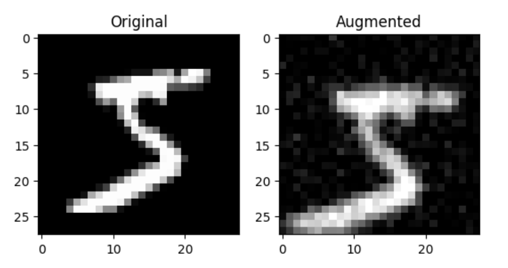

# Neural Network From Scratch

This Python script implements a simple neural network for image classification. The neural network is designed with an input layer of 784 nodes (assuming 28x28 pixel images), two hidden layers of 512 nodes each and an output layer of 10 nodes. The script uses the MNIST dataset for training and testing the neural network. The neural network is trained using mini-batch gradient descent. The script also supports training on a custom dataset and drawing a number for prediction.

## Usage

To use the script, follow these steps:

1. Clone the repository:

    ```bash
    git clone https://github.com/b14ucky/nn-from-scratch.git
    cd nn-from-scratch
    ```

2. Install the required dependencies (make sure you are using Conda or venv environment to avoid conflicts with other packages):

    ```bash
    pip install -r requirements.txt
    ```

3. Run the script with the desired parameters:

    ```bash
    python neural-network.py -e <epochs> -b <batch_size> -p -l <learning_rate> -ld <learning_rate_decay> -c -d -p
    ```

    - **-e, --epochs**: Number of epochs to train the neural network (default is 3).
    - **-b, --batch-size**: Batch size for mini-batch gradient descent (default is 32).
    - **-p, --plot-stats**: Plot the loss and accuracy statistics during training.
    - **-l, --learning-rate**: Learning rate for the neural network (default is 0.01).
    - **-ld, --learning-rate-decay**: Learning rate decay factor (default is 0.001).
    - **-c, --custom-dataset**: Use a custom dataset instead of the MNIST dataset.
    - **-d, --draw**: Draw a number to predict.

    For example, to train the neural network for 2 epochs with a learning rate of 0.001, batch size of 256 and ability to draw a number for prediction, run:

    ```bash
    python neural-network.py -e 2 -l 0.001 -b 256 -d
    ```

## Code Structure

- **neural-network.py**: Main script for training and testing the neural network.
- **utils.py**: Contains utility functions for loading data, plotting statistics, drawing numbers and image augmentation.

## Neural Network Architecture

Neural Network is composed of the following layers:
- **Input Layer**: 784 nodes (28x28 pixels) and ReLU activation function.
- **Hidden Layer 1**: 512 nodes and ReLU activation function.
- **Hidden Layer 2**: 512 nodes and ReLU activation function.
- **Output Layer**: 10 nodes and Softmax activation function.

This architecture can be easily modified by changing the number of nodes in each layer, changing an activation function or adding more layers by utilizing the `Layer` class.

## Training Process

The neural network is trained using mini-batch gradient descent, Adam optimizer and cross-entropy loss. During training, each image in batch is augmented by randomly rotating, shifting, scaling and adding noise to it. Here's an example:



Image augmentation is used to increase performance of the network in recognizing digits drawn by the user. Thanks to this technique, the network is able to achieve higher accuracy when predicting user-drawn digits. It was inspired by this [video](https://www.youtube.com/watch?v=hfMk-kjRv4c). It is possible to visualize the training process by setting the `-p` or `--plot-stats` flag. The script will plot the loss and accuracy statistics during training.


## Drawing and Prediction

If the `-d` or `--draw` option is specified and a custom dataset is not used, the script will open a drawing application. You can draw a number, and the trained neural network will predict the drawn digit. This feature is useful for testing the trained neural network on new data. You can also test the neural network on individual images from the dataset by not specifying the `-d` option.

## Dataset

The script supports training on either the default MNIST dataset or a custom dataset (specified using the `-c` flag). This custom dataset was created and used to train my number recognition model, which is employed in the [sudokuAI project](https://github.com/b14ucky/sudokuAI).

Feel free to explore and modify the script for your specific use case or dataset.

## References

https://www.youtube.com/watch?v=9RN2Wr8xvro&list=WL&index=257&t=949s